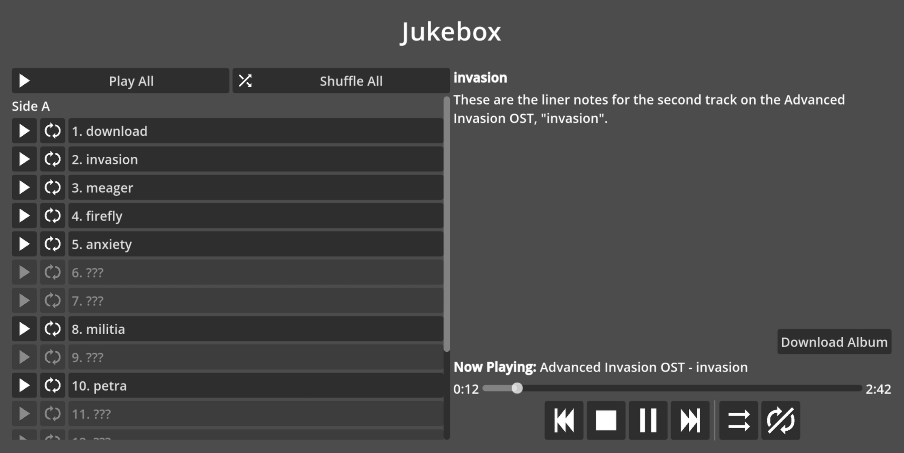

# SV Jukebox

Rudimentary Godot addon for playing music. The main attraction will be a jukebox
UI for playing game soundtracks in-game from the menu. Currently a work-in-progress.

## Usage
- Requires Godot 4.6
- Clone the repository
- Copy the `addons/sv-jukebox` folder into your Godot project's own `addons`
  folder. Create the `addons` folder if you do not have one already.
- Enable the `SV Jukebox` plugin under `Project > Project Settings... > Plugins`

## License
See [LICENSE.txt].
